# Credit Risk Analysis

## Challenge Overview
You are to oversample the data using the RandomOverSampler and SMOTE algorithms, and undersample the data using the ClusterCentroids algorithm. Then, you’ll use a combinatorial approach of over- and undersampling using the SMOTEENN algorithm. Next, you’ll compare two new machine learning models that reduce bias, BalancedRandomForestClassifier and EasyEnsembleClassifier, to predict credit risk. Finally, you’ll evaluate the performance of these models.

## Resources
- LoanStats_2019Q1.csv
- Software: Jupyter Notebook 6.0.3, Python 3.7.7, Visual Studio Code 1.47.2

## Challenge Results

| **Oversampling** | **Smote** |
|:----------------:|:---------:|
| 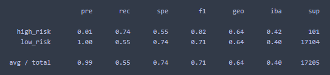 | 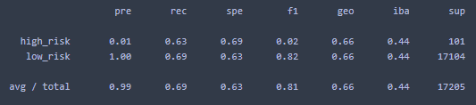 |
| 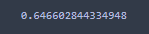 | 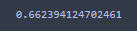 |
| **Undersampling** | **Smoteenn** |
| 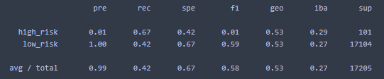 | 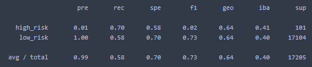 |
| 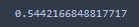 | 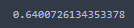 |
| **Random Forest** | **Adaboost** |
| 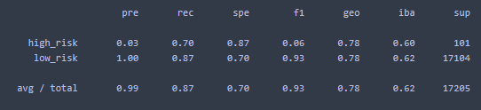 | 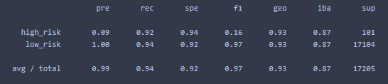 |
| 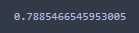 | 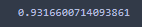 |

- 